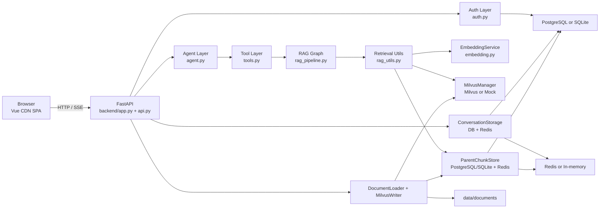
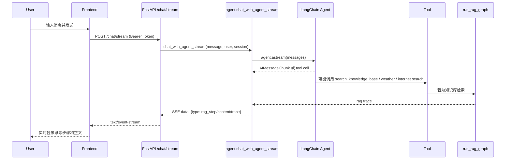
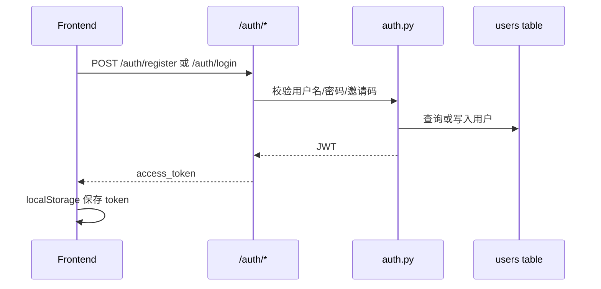
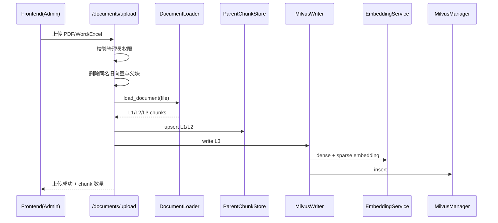

# 02. 架构与数据流

## 2.1 架构总览

## 2.2 前端到后端的请求流

### 普通聊天

### 登录/注册

### 文档上传

## 2.3 核心运行链路

### 链路 A：页面加载

1. 浏览器访问 `/`
2. FastAPI 在 `backend/app.py` 中把 `frontend/` 挂载到根路径
3. 前端 HTML 从 CDN 拉取 Vue、marked、highlight.js、字体和图标
4. 若 `localStorage` 中存在 `accessToken`，前端调用 `/auth/me` 恢复登录态

### 链路 B：聊天消息

1. 前端调用 `/chat/stream`
2. 后端从 `ConversationStorage` 加载历史消息
3. 超过 50 条消息时，对前 40 条做摘要并用 `SystemMessage` 替换
4. LangChain Agent 开始生成
5. 若模型决定调用工具，则进入 `tools.py`
6. 知识库工具会触发 `run_rag_graph()`
7. RAG 图生成答案与 trace
8. 后端通过 SSE 同时输出正文 chunk 和过程步骤
9. 结束后保存完整会话消息到数据库并回填缓存

### 链路 C：历史会话

1. `/sessions` 返回当前用户所有会话
2. `/sessions/{session_id}` 返回某会话全部消息
3. 前端切换 `sessionId` 后恢复历史消息
4. `/sessions/{session_id}` DELETE 可删除当前用户会话

### 链路 D：知识库生命周期

1. 管理员上传文档
2. 文档落盘到 `data/documents/`
3. 分成 L1/L2/L3 三层块
4. L1/L2 存入关系数据库 `parent_chunks`
5. L3 生成 dense/sparse 向量并写入 Milvus
6. 查询时优先检索 L3
7. 若满足 auto-merge 阈值，则把多个子块折叠成父块
8. 结果经过可选 rerank，再进入生成阶段

## 2.4 模块间依赖

### 强依赖

- `backend/api.py` 直接依赖 `agent.py`、`auth.py`、`document_loader.py`、`milvus_writer.py`
- `agent.py` 直接依赖 `tools.py` 和数据库模型
- `tools.py` 直接依赖 `rag_pipeline.py`
- `rag_pipeline.py` 直接依赖 `rag_utils.py`
- `rag_utils.py` 直接依赖 `EmbeddingService`、`MilvusManager`、`ParentChunkStore`

### 隐式依赖

- 多处模块在 import 时初始化单例，这使运行环境被“导入动作”提前绑定
- `backend/app.py` 与 `backend/api.py` 采用裸导入，依赖运行时 `sys.path`
- 前端默认假设后端接口与静态资源同域

## 2.5 SSE 与中断机制

当前流式方案不是直接把模型输出原样透传，而是做了一个统一事件队列。

核心思路：

1. `chat_with_agent_stream()` 创建 `asyncio.Queue`
2. 把一个代理对象注入到 `tools.set_rag_step_queue()`
3. Agent 在后台任务里运行
4. 正文 token 转成 `{type: "content"}`
5. RAG 步骤通过 `emit_rag_step()` 跨线程安全写入队列，转成 `{type: "rag_step"}`
6. 结束后再发送 `{type: "trace"}` 和 `[DONE]`

这意味着前端能在工具还没结束时看到“正在检索 / 正在评估 / 正在重写查询”等阶段信息。

### 中断

前端：

- 使用 `AbortController`
- 点击停止按钮后中断 `/chat/stream` 请求

后端：

- SSE 生成器收到 `GeneratorExit`
- 取消后台 `agent_task`
- 清理 RAG 队列引用

这是一个比较实用的实现，但取消是否一定能中断底层模型/HTTP 请求，仍取决于 LangChain/模型客户端的取消传播行为，代码里没有更底层的资源回收控制。

## 2.6 用户体系架构

当前用户体系包含以下元素：

- 用户表：`users`
- JWT 令牌：`sub=username`，`role=role`
- RBAC：`admin` / `user`
- 会话归属：`chat_sessions.user_id`
- 消息归属：通过 `chat_sessions` 关联
- 前端 token 持久化：`localStorage`

不包含以下能力：

- refresh token
- token 黑名单
- session 失效控制
- 多设备管理
- 审计日志

## 2.7 当前架构的优点

- 单体结构清晰，适合迭代快
- 本地开发门槛低，有 mock 回退
- 文档处理、检索、回答、可视化 trace 是完整闭环
- 前端部署简单，不需要额外打包流程

## 2.8 当前架构的代价

- 模块边界偏松，依赖通过裸导入和全局单例传播
- 本地回退模式与目标生产模式差异较大
- 代码把“状态”“配置”“连接”都放在 import 阶段初始化，测试与部署都比较脆弱
- 部分接口契约与前端展示字段没有完全对齐
