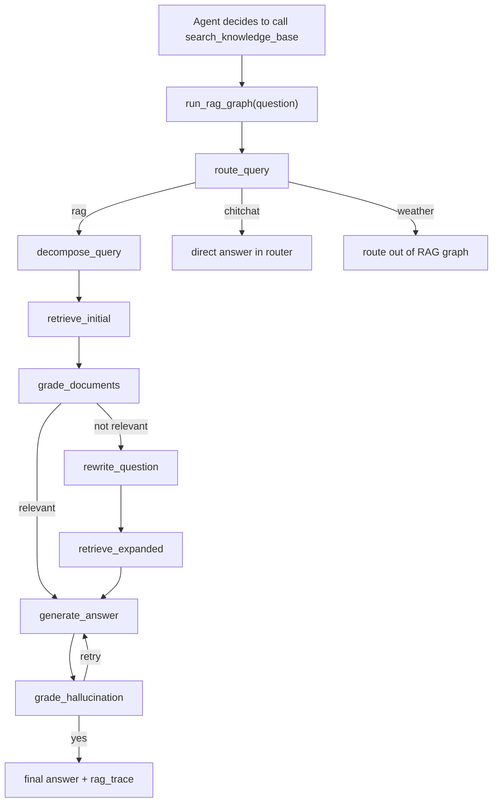

# 05. RAG 全链路

## 5.1 总览

当前 RAG 不是“前端直接调检索接口”，而是：

- Agent 先决定是否调用 `search_knowledge_base`
- 工具内部再运行 `run_rag_graph()`
- RAG 图负责路由、召回、重写、回答、幻觉检测

也就是说，RAG 是 Agent 的一个工具能力，而不是顶层 API。

## 5.2 文档上传到入库

### 真实调用链

```text
/documents/upload
  -> api.upload_document()
    -> DocumentLoader.load_document()
      -> _split_page_to_three_levels()
    -> ParentChunkStore.upsert_documents(parent_docs)
    -> MilvusWriter.write_documents(leaf_docs)
      -> EmbeddingService.fit_corpus()
      -> EmbeddingService.get_all_embeddings()
      -> MilvusManager.insert()
```

### 步骤拆解

1. 管理员上传文件
- 只允许 PDF / Word / Excel

2. 删除同名旧数据
- Milvus 中删除 `filename == "<文件名>"`
- 父块表中按文件名删除

3. 原始文件落盘
- 保存到 `data/documents/<filename>`

4. 文档解析
- PDF 用 `PyPDFLoader`
- Word 用 `Docx2txtLoader`
- Excel 用 `UnstructuredExcelLoader`

5. 三级分块
- 每页文本会被递归拆成三层：
  - L1：1000 token
  - L2：500 token
  - L3：250 token

6. 分层存储
- L1/L2：写入 `parent_chunks`
- L3：写入 Milvus

7. 向量化
- dense：调用外部 embedding API
- sparse：本地 BM25 稀疏向量

### 数据结构

每个 chunk 至少带这些字段：

- `text`
- `filename`
- `file_type`
- `file_path`
- `page_number`
- `chunk_id`
- `parent_chunk_id`
- `root_chunk_id`
- `chunk_level`
- `chunk_idx`

## 5.3 查询时的 Agent 调用链

```text
/chat/stream
  -> agent.chat_with_agent_stream()
    -> LangChain Agent
      -> tool: search_knowledge_base(query)
        -> run_rag_graph(question)
          -> route_query
          -> decompose_query
          -> retrieve_initial
          -> grade_documents
          -> rewrite_question (optional)
          -> retrieve_expanded (optional)
          -> generate_answer
          -> grade_hallucination
```

## 5.4 RAG 图节点说明

### 1. `route_query_node`

职责：

- 识别问题属于 `weather` / `rag` / `chitchat`

实现：

- 用 `_get_router_model()` 做分类
- 失败则默认 `rag`

输出：

- `intent`
- `route`

### 2. `decompose_query_node`

职责：

- 为 RAG 生成最多 3 个子查询

实现：

- 结构化输出 `MultiQuery`
- 失败时回退为单查询

输出：

- `queries`

### 3. `retrieve_initial`

职责：

- 对每个子查询做初次检索并合并去重

实现：

- 顺序遍历 `queries`
- 每个查询调用 `retrieve_documents(q, top_k=3)`
- 根据 `(filename, text 前 100 字符)` 去重
- 最终按 `score` 排序取前 5

输出：

- `docs`
- `context`
- `rag_trace.retrieved_chunks`

说明：

- 这里当前只把初次结果写到 `retrieved_chunks`
- 没有单独写入 `initial_retrieved_chunks`

### 4. `grade_documents_node`

职责：

- 评估当前召回文档是否足够相关

结果：

- `yes` -> `generate_answer`
- `no` -> `rewrite_question`

失败策略：

- 结构化输出异常时，会默认按 `yes` 处理以避免打断流程

### 5. `rewrite_question_node`

职责：

- 选择查询扩展策略并生成重写结果

策略：

- `step_back`
- `hyde`
- `complex`

### 6. `retrieve_expanded`

职责：

- 对扩展后的查询或假设文档重新检索

实现：

- `hyde` / `complex`：用假设文档检索
- `step_back` / `complex`：用扩展查询检索
- 合并去重
- 重排 `rrf_rank`

输出：

- `expanded_query`
- `step_back_question`
- `step_back_answer`
- `hypothetical_doc`
- `expanded_retrieved_chunks`
- `retrieved_chunks`

### 7. `generate_answer_node`

职责：

- 基于拼接后的 context 生成最终回答

特点：

- 使用 `ANSWER_PROMPT`
- 要求回答可带 `[1]`、`[2]` 形式引用

### 8. `grade_hallucination_node`

职责：

- 检查回答是否 grounded

策略：

- `yes` -> finalize
- `no` 且重试次数 < 2 -> retry generate_answer
- 多次失败后仍会 finalize，但在 trace 中标记

## 5.5 检索实现细节

### 5.5.1 dense + sparse

`retrieve_documents()` 先尝试：

- dense embedding
- sparse embedding
- `MilvusManager.hybrid_retrieve()`

若失败，则降级：

- `MilvusManager.dense_retrieve()`

### 5.5.2 rerank

条件：

- `RERANK_MODEL`
- `RERANK_API_KEY`
- `RERANK_BINDING_HOST`

行为：

- 调用 `/v1/rerank`
- 失败时保留原召回顺序
- trace 会记录是否配置、是否执行、错误信息等

### 5.5.3 auto-merge

逻辑：

1. 先按 `parent_chunk_id` 聚合同一父块下的多个子块
2. 若某父块命中子块数达到阈值，回查父块文本
3. 用父块替换多个子块
4. 两轮合并：
- L3 -> L2
- L2 -> L1

意义：

- 回答时得到更完整上下文
- 减少多个碎片块重复出现

## 5.6 流式 trace 机制

RAG 图不是直接返回 trace 给前端，而是经过两层传播：

1. 节点调用 `emit_rag_step(icon, label, detail)`
2. `chat_with_agent_stream()` 预先把代理队列注入 `tools.set_rag_step_queue()`
3. 前端实时收到 `rag_step`
4. RAG 图结束后，`search_knowledge_base()` 再把最终 `rag_trace` 存到 `_LAST_RAG_CONTEXT`
5. Agent 流程结束后，统一发送 `trace`

## 5.7 当前实现的关键优点

- 支持多查询分解
- 支持 Step-Back 与 HyDE
- 支持相关性门控与查询重写
- 支持 groundedness 检测
- 支持检索步骤可视化
- 支持 auto-merge 和可选 rerank

## 5.8 当前实现的关键问题

### 问题 1：BM25 稀疏状态不稳定

代码证据：

- `EmbeddingService.save_state()` 存在，但主链路未调用
- `MilvusWriter.write_documents()` 用自己的 `EmbeddingService.fit_corpus()`
- `rag_utils.py` 查询时用另一个全局 `_embedding_service`

影响：

- 查询时稀疏词表可能与入库时不一致
- 在真实 Milvus hybrid 模式下，sparse 分量可能失真

### 问题 2：mock 模式不能验证 hybrid 检索真实性能

代码证据：

- `AdvancedMockMilvusClient.hybrid_search()` 直接代理到 dense search

影响：

- 本地“看起来工作正常”，但并没有真正验证 sparse + dense + RRF 的效果

### 问题 3：trace 契约未完全闭环

代码证据：

- schema 有 `tool_name`、`initial_retrieved_chunks`
- 当前 RAG trace 没有完整写入

影响：

- 前端会展示空白或缺失状态

## 5.9 一个完整示意图


